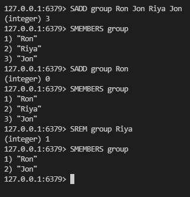

# Redis
Redis is like session storage or local storage that stores a huge object [object is `key:"value"` pair]<br>

## Installation of Redis

Linux : 
```
apt-get redis
``` 
MacOS : 
```
brew install redis
``` 
Windows: 
```
(switch to linux, then install) or (unofficial) go to https://github.com/microsoftarchive, then 'redis' Repo, then download the zip file of latest version from there.
```

### To Start Redis server(for windows)
```
redis-server
```

### To Start Redis Cli (common for all)
```
redis-cli
```

### Operations

```
SET name Riya  -> OK
GET name  -> "Riya"
SET age 30  -> OK
GET age  -> "30"
DEL age  -> (integer)1 [here 1 says, 1 value deleted]
EXISTS name  -> (integer)1
KEYS *  -> 1) "name"
*** FLUSHALL  -> OK [will delete all data]
KEYS *  -> (empty list or set)
SET name Riya  -> OK
GET name  -> "Riya"
TTL name  -> (integer) -1 [since no expiration time given]
EXPIRE name 10  -> (integer) 1 [key will expire in 10 seconds]
TTL name  -> (integer) 6 [tiem left for expiration]
TTL name  -> (integer) 5
TTL name  -> (integer) 2
TTL name  -> (integer) -2 [Key expired]
TTL name  -> (integer) -2 [Key expired]
GET name  -> (nil)
SETEX name 30 Riya -> OK [will set key and its expiring time]
CLEAR [to clear the screen]
```


### Dealing with arrays 


RPUSH = Right PUSH <br>
LPUSH = Left PUSH <br>
and so on...<br>
```
redis = {
    "friends" : ["Ron", "Jon"],
    "num" : "3"
}
```

### Redis Sets



```
redis = {
    "friends" : ["Ron", "Jon"],
    "group" : ["Ron", "Jon"],
    "num" : "3",
}
```

### Redis Hashes (objects) 


```
redis = {
    "friends" : ["Ron", "Jon"],
    "group" : ["Ron", "Jon"],
    "num" : "3",
    "person" : {
        "name" : "Riya"
    }
}
```

[RedisJSON - a JSON data type for Redis](http://rejson.io/)

<br>
<hr><hr><hr><hr><hr>

# PostgreSQL


